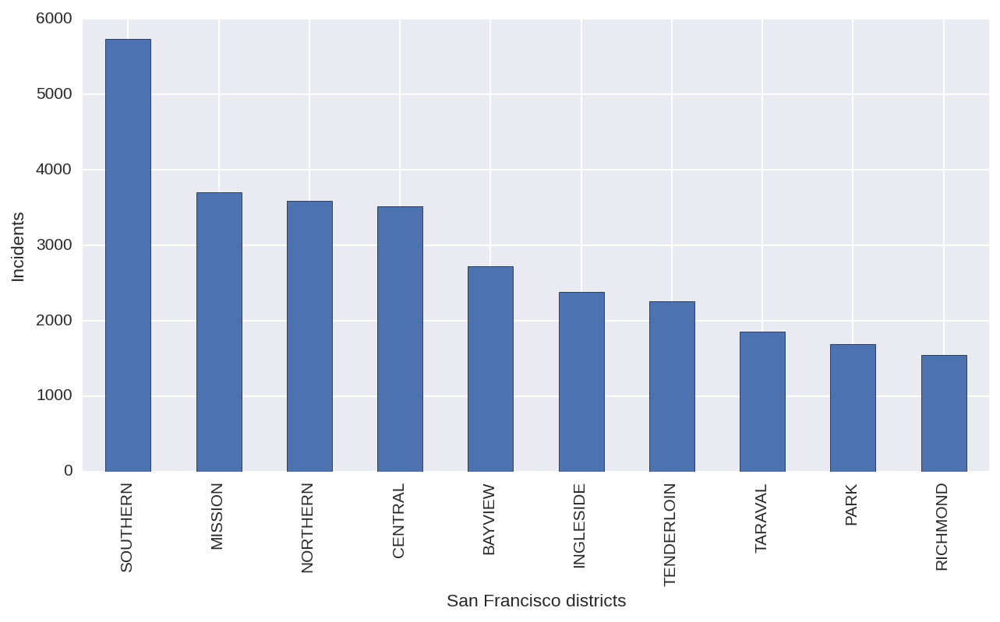

# Southern district is the most affected district by larceny and theft

Out target in the study of the sanfrancisco_incidents_summer_2014 dataset is to identify the district that is most affected by incidents and the type of incidents that are most common on it.

This first graph shows the amount of incidents per district, ordered from highest to lowest rate. Southern jumps out very clearly as the district most affected by incidents.

If we would like to tackle the incidents with highest impact, we would need to know what types of incidents are most common so that law enforcement can focus their efforts on it. The following plot show the distribution of incidents by category and also by district. Larceny and theft (combined in a single category in the dataset) also jump out at the first look. There is a single box that calls for attention: the amount of larceny and theft in the Southern district.

One key aspect required to tackle the problem is the surface area of the affected districts. The following map shows the relative amount of larceny and theft incidents across districts, compared with the extension of those districts. Southern is not only the most affected one, but its incidents are restricted to a relatively small area compared to other districts such as 

